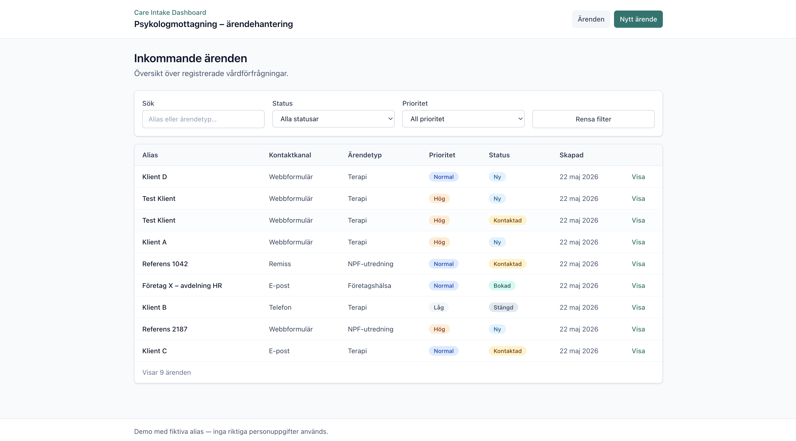
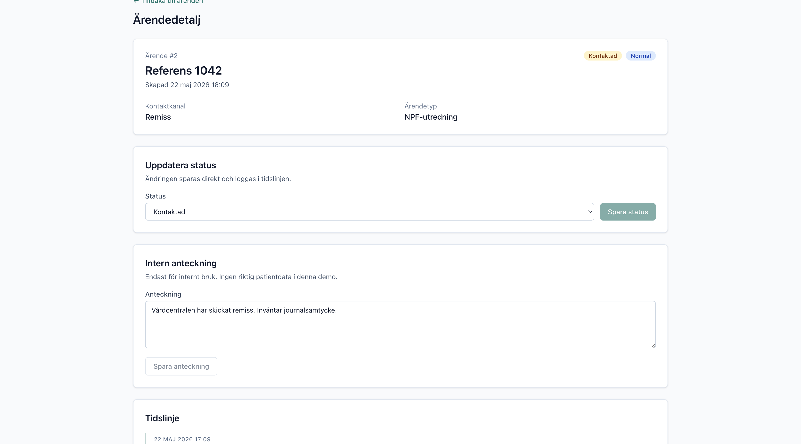
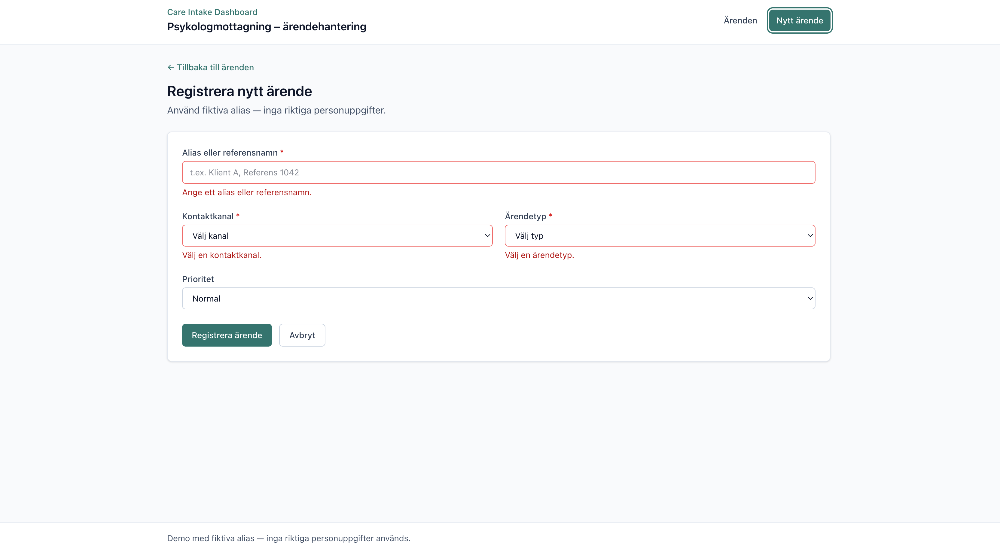

# Care Intake Dashboard

API-first care intake dashboard — Laravel, Vue 3 & Tailwind. Portfolio demo for fictional case management with accessibility and clear status workflows.

Fullstack-demo för fiktiv ärendehantering på en psykologmottagning — Laravel API + Vue 3 SPA. Fokus på tydlig domänlogik, API-first-arkitektur, tillgänglighet och underhållbar kodstruktur.

> Demo med fiktiva alias. Inga riktiga personuppgifter används.

**Repo:** [github.com/linneaegner/care-intake-dashboard](https://github.com/linneaegner/care-intake-dashboard)  
**Case study:** [linnea.egner.se/projects/care-intake-dashboard](https://linnea.egner.se/projects/care-intake-dashboard)

## Stack

| Lager | Teknik |
|-------|--------|
| Backend | Laravel 13, PHP 8.3+ |
| Frontend | Vue 3, Vue Router, Vite |
| Styling | Tailwind CSS 4 |
| Databas | SQLite |
| Tester | PHPUnit (9 API-tester) |

## Funktioner

- Lista, filtrera och sök ärenden (alias, kanal, typ, prioritet, status)
- Registrera nytt ärende med server-side validering
- Detaljvy med intern anteckning och tidslinje
- Uppdatera status via API utan sidomladdning
- WCAG-grunder: labels, focus states, semantisk HTML, `aria-live`

## Skärmdumpar







Fler bilder och reflektioner finns i [case studyn](https://linnea.egner.se/projects/care-intake-dashboard).

## Arkitektur

```
Vue SPA → Laravel API (/api/cases) → Controller → Form Request → Service → Model → API Resource
```

Backend: `Enums/`, `Http/Requests/`, `Services/IntakeCaseService`, `Http/Resources/`  
Frontend: Vue-komponenter (`CaseList`, `CaseFilters`, `CaseForm`, `CaseDetail`) + API-klient i `resources/js/api/cases.js`

## Kom igång

**Krav:** PHP 8.3+, Composer, Node.js 18+, npm

```bash
git clone https://github.com/linneaegner/care-intake-dashboard.git
cd care-intake-dashboard

composer install
cp .env.example .env
php artisan key:generate

touch database/database.sqlite
# Säkerställ DB_CONNECTION=sqlite i .env
php artisan migrate --seed

npm install
npm run build
php artisan serve
```

Öppna http://127.0.0.1:8000

**Utvecklingsläge (hot reload):** kör `php artisan serve` och `npm run dev` parallellt. Öppna fortfarande port 8000.

**Tester:**

```bash
php artisan test
```

## API

| Metod | Endpoint | Beskrivning |
|-------|----------|-------------|
| GET | `/api/cases` | Lista (`?status=`, `?priority=`, `?search=`) |
| POST | `/api/cases` | Skapa ärende |
| GET | `/api/cases/{id}` | Hämta med tidslinje |
| PATCH | `/api/cases/{id}/status` | Uppdatera status |
| PATCH | `/api/cases/{id}/note` | Uppdatera intern anteckning |

## Licens

MIT
